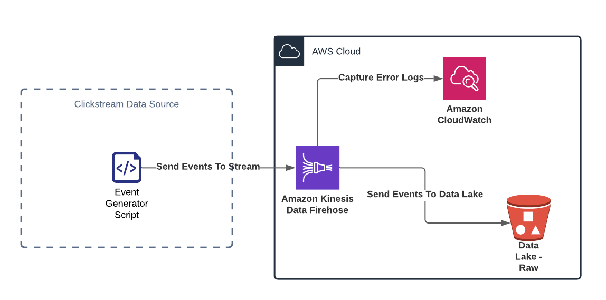

# Clickstream Data Ingestion
Analysis of clickstream datat requires collecting, analyzing and reporting aggregate data about which pages a website visitor visits, and in what order. 
Most vendor solutions such as segment provide a rich set of clickstream data. Clickstream data contain detailed logs of how users navigate through a Web. The log typically includes the pages visited, time spent on each page, how they arrived on the page, and where they went next. From an aggregate perspective, clickstream data provide tremendous insights into how easily the site is navigated, what pages are causing the greatest confusion, and what pages are critical in reaching a desired destination.

This project presents an example pipeline of clickstream data ingestion. A geneator script generates 
semi-structured and nested clickstream data logs. The stream events are sent to an AWS kinesis queue,
which is connected to cloudwatch for monitoring and also a data lake of S3 buckets.

The infrustructure is provisioned using Terraform and AWS is used as a cloud provider.

DISCLAIMER: This is in no way a complete project and can/will be built upon or improved as time permits. 

## Licence & Tech Stack 

## Architecture

## Author

- [@salimdason](https://www.github.com/salimdason)

